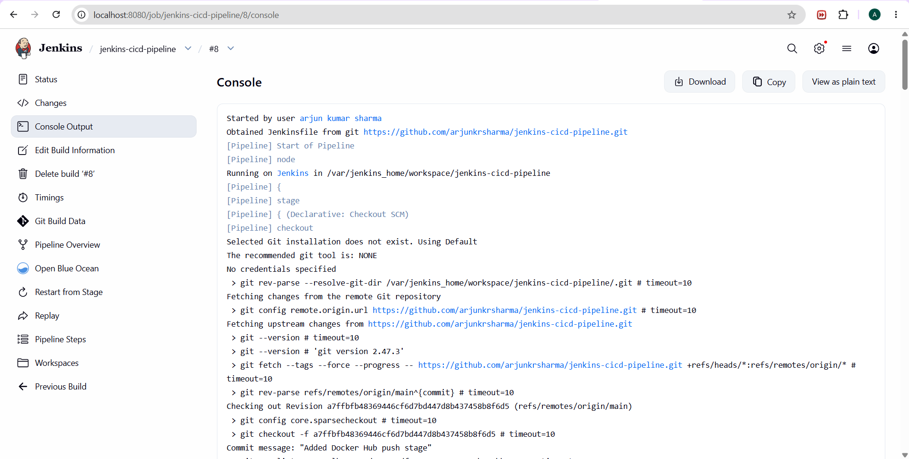
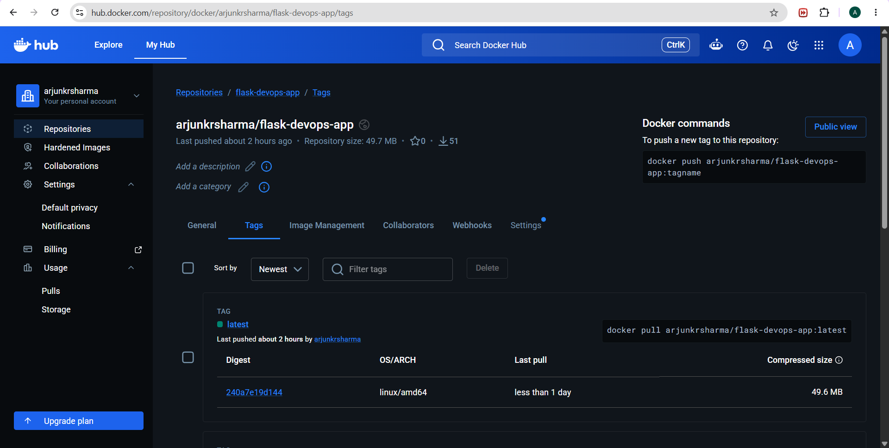
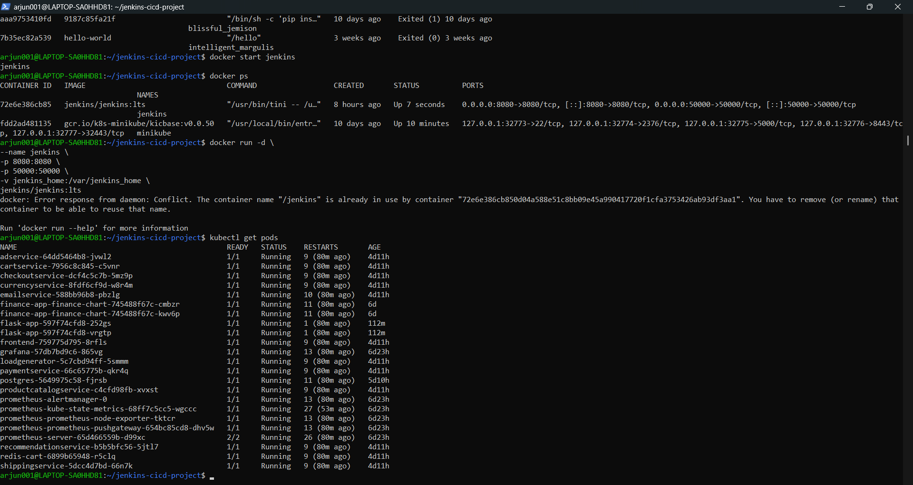
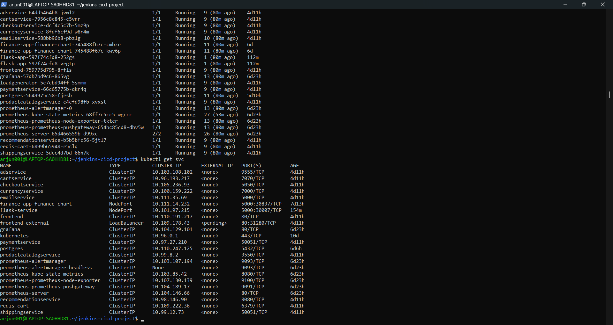
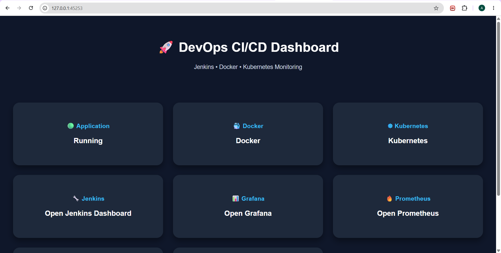

# 🚀 Jenkins CI/CD Pipeline with Kubernetes Deployment

[]()
[]()
[]()
[]()

## 📌 Project Overview

This project demonstrates a complete **CI/CD (Continuous Integration and Continuous Deployment)** pipeline using:

* GitHub
* Jenkins
* Docker
* Docker Hub
* Kubernetes (Minikube)
* Flask Application

The application is automatically built, containerized, pushed to Docker Hub, and deployed to Kubernetes whenever changes are pushed to GitHub.

---

# 🏗️ Architecture

```text
Developer
    ↓
GitHub Repository
    ↓
Jenkins Pipeline
    ↓
Docker Build
    ↓
Docker Hub
    ↓
Kubernetes Deployment
    ↓
Live Flask Application
```

---

# 🛠️ Tech Stack

| Technology   | Purpose                  |
| ------------ | ------------------------ |
| Python       | Backend Application      |
| Flask        | Web Framework            |
| Docker       | Containerization         |
| Docker Hub   | Image Registry           |
| Jenkins      | CI/CD Automation         |
| Kubernetes   | Container Orchestration  |
| Minikube     | Local Kubernetes Cluster |
| Git & GitHub | Version Control          |

---

# 📂 Project Structure

```text
jenkins-cicd-project/
│
├── app.py
├── requirements.txt
├── Dockerfile
├── Jenkinsfile
│
├── templates/
│   └── index.html
│
├── static/
│   └── style.css
│
├── k8s/
│   ├── deployment.yaml
│   └── service.yaml
│
├── screenshots/
│   ├── jenkins-pipeline.png
│   ├── dockerhub.png
│   ├── kubernetes-pods.png
│   ├── kubernetes-services.png
│    ── dashboard.png
│   
│
└── README.md
```

---

# 🚀 Features

✅ End-to-End CI/CD Pipeline

✅ Automated Docker Image Build

✅ Automated Docker Hub Push

✅ Kubernetes Deployment

✅ Flask Dashboard Application

✅ Responsive DevOps Dashboard

✅ Automated Build and Deployment Workflow

---

# ⚙️ Installation Steps

## Clone Repository

```bash
git clone https://github.com/arjunkrsharma/jenkins-cicd-pipeline.git
cd jenkins-cicd-pipeline
```

---

# 🐳 Build Docker Image

```bash
docker build -t arjunkrsharma/flask-devops-app:latest .
```

---

# Push Image to Docker Hub

```bash
docker push arjunkrsharma/flask-devops-app:latest
```

---

# ☸️ Deploy on Kubernetes

Apply manifests:

```bash
kubectl apply -f k8s/
```

Check pods:

```bash
kubectl get pods
```

Check services:

```bash
kubectl get svc
```

Open application:

```bash
minikube service flask-service
```

---

# 🔧 Jenkins Pipeline Workflow

## Stage 1 – Checkout Code

Pulls latest source code from GitHub.

## Stage 2 – Build Docker Image

Creates Docker image from application source.

## Stage 3 – Push to Docker Hub

Pushes latest image to Docker Hub repository.

## Stage 4 – Deploy to Kubernetes

Deploys latest image into Kubernetes cluster.

---

# 📸 Project Screenshots

## Jenkins Pipeline



---

## Docker Hub Repository



---

## Kubernetes Pods



---

## Kubernetes Services



---

## Running Dashboard



---

## Architecture Diagram


---

# 🖥️ Dashboard Features

The dashboard provides:

* Application Status
* Docker Status
* Kubernetes Status
* Jenkins Integration
* Version Information
* Host Information
* Quick Access Cards

---

# 🔄 CI/CD Flow

```text
Code Push
     ↓
GitHub
     ↓
Jenkins Build
     ↓
Docker Build
     ↓
Docker Hub
     ↓
Kubernetes Deployment
     ↓
Live Application
```

---

# 📈 Future Improvements

* GitHub Webhooks
* Prometheus Monitoring
* Grafana Dashboards
* Helm Charts
* Terraform Integration
* AWS EKS Deployment
* ArgoCD GitOps

---

# 👨‍💻 Author

## Arjun Kumar Sharma

